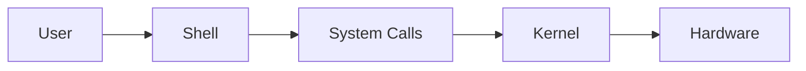

# 🖥️ From User to Hardware: How a Command Travels in an Operating System  

Have you ever typed `ls` in Linux or `dir` in Windows and wondered *what really happens under the hood*?  
The journey from your keyboard to the hardware is fascinating. In this blog, we’ll walk through it step by step:  

---

## 1. User: The Starting Point  
It all begins with **you**. You type something like:  
```bash
cat hello.txt
```  
From your perspective, it’s simple. But this is just a **string of characters** for the system. Someone needs to understand it.  

---

## 2. Shell: The Interpreter  
The **shell** (like Bash, Zsh, or PowerShell) is your translator.  

- Reads the command (`cat hello.txt`).  
- Figures out you want to run the program `cat` with argument `hello.txt`.  
- Prepares to launch this program by talking to the **kernel**.  

Think of the shell as a middleman: it doesn’t read files itself. Instead, it asks the **kernel** to do the heavy lifting.  

---

## 3. System Calls: The Gatekeepers  
Programs can’t directly access hardware (for safety!). Instead, they use **system calls** (APIs provided by the kernel).  

For our example, the shell internally uses:  
- `fork()` → to create a child process.  
- `exec()` → to load the `cat` program into that process.  
- `wait()` → to wait until `cat` finishes.  

Inside `cat`, system calls do the real work:  
- `open("hello.txt")` → open the file.  
- `read()` → read its contents.  
- `write()` → print text to your screen.  

---

## 4. Kernel: The Brain  
The **kernel** is the core of the OS. It decides:  
- Which process gets CPU time.  
- How memory is allocated.  
- How to talk to hardware.  

When `cat` calls `read()`, the kernel looks up the file on disk, fetches data into memory, and hands it back to the process.  

---

## 5. Hardware: The Final Destination  
Finally, the kernel issues commands to the **hardware drivers**:  
- Disk controller → fetch file blocks from storage.  
- GPU/Display → render text on your monitor.  
- Keyboard & mouse → send input signals back.  

What you see as “magic” is actually a carefully coordinated chain of requests.  

---

## 6. Full Flow Recap  
Here’s the journey in one line:  

```
User → Shell → System Calls → Kernel → Hardware
```

### Diagram (Flow)  



Example (`cat hello.txt`):  
1. User types command.  
2. Shell parses → uses `fork()`, `exec()`, `wait()`.  
3. `cat` program uses `open()`, `read()`, `write()`.  
4. Kernel talks to disk + display.  
5. File contents appear on screen. 🎉  

---

## ✨ Why It Matters  
- **Debugging**: Understanding where things can fail (shell parsing error vs kernel permissions error).  
- **Security**: Only kernel mediates hardware access → prevents malicious direct access.  
- **Performance**: Tools like `strace` let you watch system calls → helpful for optimization.  

---

✅ So next time you type a command, remember: a whole orchestra of shell, system calls, kernel, and hardware works together just to make your request happen.  
